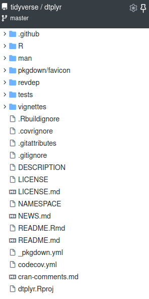

```{r xaringan-setup, echo=FALSE}
xaringanExtra::use_tile_view()
xaringanExtra::use_freezeframe()
xaringanExtra::use_clipboard()
xaringanExtra::use_broadcast()
```


```{r metathis, echo=FALSE}
# https://www.garrickadenbuie.com/blog/sharing-xaringan-slides/
library(metathis)
meta() %>%
  meta_name("github-repo" = "llrs/packages2archives") %>% 
  meta_social(
    title = "Releasing packages to archives",
    description = paste(
      "Slides for the",
      "For R User Group Gahna on their 3rd aniversary."
    ),
    url = "https://packages2archives.llrs.dev",
    image = "https://packages2archives.llrs.dev/index_files/figure-html/title_slide_screenshot.png",
    image_alt = paste(
      "Image of the first slide for 'Releasing packages to archives'", 
      ".", 
      "Done for the R User Group Ghana on 2022/01/16 by Lluís Revilla Sancho"
    ),
    og_type = "website",
    og_author = "Lluís Revilla Sancho",
    twitter_card_type = "summary_large_image",
    twitter_creator = "@Lluis_Revilla"
  )
```


```{r setup, include=FALSE}
options(htmltools.dir.version = FALSE)
```

???

Image credit: [Wikimedia Commons](https://commons.wikimedia.org/wiki/File:Sharingan_triple.svg)

---

# Creating good packages

Workshops and material


---

## Example

.left-column[

```{r, echo=FALSE, out.width="100%", fig.alt="Tree view of the dtplyr package repository on 2021/08/06."}

```

]

.right-column[
- `.github` folder: Files specific to GitHub (this isn't necessary/[Advanced content](#advanced))
- A `R` folder with [*.R files](#r-files): your code.
- A `man` folder with [*.rd files](#rd-files): your documentation.
- A `tests` folder: [Check the code](#tests) of the package.
- A [`vignette` folder](#vignettes): Long documentation; not just examples.
- A `.Rbuildignore`: A file describing what to omit when building the package.
- A [`DESCRIPTION` file](#description): Summary and description of the package.
- A [`LICENSE` file](#licenses): The conditions under the package is released.
- A [`NAMESPACE` file](#namespace): What this package shares and needs.
- A [`NEWS` file](#news): What has changed since last release.
- A [`README`](#readme): How to install and why this packages is needed and some basic examples.
]


---
# Choosing the right archive/repository

##  Repository

Git repository vs ropensci

## Archive

CRAN/Bioconductor vs Zenodo

## All

R-universe + CRAN/Bioconductor

---
# Maintaining the package

Better quality => Less work

Iteration process

## New features

## Deprecating features

---

# Conclusions

